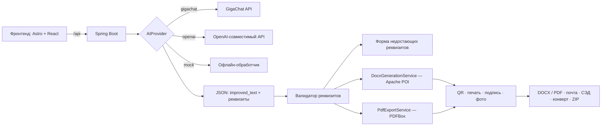

# DocHelper — ИИ-конструктор служебных документов «Документ за 3 шага»

Веб-приложение для кейса Первенства России по дисциплине «Продуктовое программирование» (ФСП):
превращает черновой текст в готовый редактируемый DOCX/PDF — с исправлением ошибок силами ИИ,
автоматическим оформлением по шаблону, печатью, подписью и QR-кодом проверки подлинности.

**🌐 Публичная версия (деплой):** https://celebrated-heart-production-fac4.up.railway.app/

**🎥 Видео защиты:** https://disk.yandex.ru/i/MhOOBHxVqIvcIw

---

## Быстрый старт (локально)

Требования: Java 17+, Maven 3.9+, Node.js 22+.

```bash
# 1. Фронтенд (порт 4321)
cd frontend
npm install
npm run dev

# 2. Бэкенд (порт 8080, в другом терминале)
cd backend
mvn spring-boot:run
```

Открыть: http://localhost:4321 — фронтенд проксирует `/api` на бэкенд (настроено в `frontend/astro.config.mjs`).

**Без ключей ИИ приложение работает** — активируется встроенный офлайн-провайдер `mock`
(детерминированная обработка текста без нейросети). Ключ GigaChat включают переменной `AI_GIGACHAT_AUTH_KEY`.

### Переменные окружения (backend/.env, пример — .env.example)

| Переменная | Значение | Зачем |
|---|---|---|
| `AI_PROVIDER` | `mock` / `openai` / `gigachat` | выбор ИИ-провайдера (по умолчанию mock) |
| `AI_GIGACHAT_AUTH_KEY` | base64-ключ из [Studio Сбера](https://studio.giga.chat) | включает GigaChat (пусто → mock) |
| `AI_GIGACHAT_SCOPE` | `GIGACHAT_API_PERS` | тариф доступа (физлица) |
| `AI_GIGACHAT_INSECURE_SSL` | `true` только для демо-контейнера | если JDK не доверяет сертификатам НУЦ Минцифры (PKIX) |
| `AI_SIMULATE_FAILURE` | `true` | имитация недоступности ИИ (сценарий 6 ТЗ) |
| `MAIL_HOST/PORT/USERNAME/PASSWORD` | SMTP-аккаунт | кнопка «Отправить по почте» |

GigaChat-провайдер сам получает `access_token` по Authorization key (OAuth2, обновление автоматически),
запросы уходят на `https://api.giga.chat/v1/chat/completions` (запасной адрес —
`https://gigachat.devices.sberbank.ru/api/v1`, код не дублирует сегмент `/v1`).
Состояние провайдера: `GET /api/health`.

---

## Публичный деплой (Railway, бесплатно, без карты)

1. Код репозитория в GitHub.
2. https://railway.app → Login with GitHub → **New Project → Deploy from GitHub repo** → выбрать репозиторий.
   Railway сам определит `Dockerfile` (бэкенд + собранный фронт в одном контейнере, порт из `PORT`).
3. **Variables** — добавить переменные из таблицы выше (`AI_GIGACHAT_AUTH_KEY` обязателен для ИИ).
4. **Settings → Networking → Generate Domain** — постоянная ссылка вида `*.up.railway.app`.

Альтернатива с ПК: `start_dochelper.bat` (бэк + фронт + публичный туннель) или
`powershell -File tunnel_watchdog.ps1` (автоперезапуск туннеля pinggy, актуальная ссылка в `current_url.txt`).

---

## Как это работает (сценарий — 3 шага)

1. **Ввод черновика**: вручную, из буфера, готовым файлом (.docx/.pdf/.txt — текст извлекается
   автоматически, тип документа определяется) или демо-примеры из стартовых материалов.
2. **Тип + шаблон**: 4 обязательных типа (служебная записка, докладная, информационная справка, письмо)
   и 4 шаблона оформления: «Классический корпоративный», «Современный регламентный», «Свой шаблон»
   (шрифт/размер/интервалы/отступы/колонтитулы настраиваются), «Бланк моей организации» (загрузка
   своего .docx — колонтитулы, поля и стили бланка сохраняются). Плюс корпоративные шаблоны и свои
   типы документов из настроек.
3. **Проверка → скачивание**: улучшенный текст показывается **в виде реального файла** (что видишь —
   то и качаешь), недостающие реквизиты запрашиваются формой (или явно помечаются «[Заполнить]»),
   скачивание в **DOCX или PDF**.



### Модуль ИИ (раздел 1.2 ТЗ) — промпты и защита от галлюцинаций

- Системный промпт: `OpenAICompatibleProvider.systemPrompt()` — правила грамотности,
  официально-делового стиля, структуры «кому → от кого → суть → подпись» и строгого запрета
  на выдумывание фактов, дат, фамилий и номеров.
- Ответ модели — **строго JSON**: `improved_text` + извлечённые реквизиты (`recipient`, `author`,
  `date`, `number`, `subject`, `signature`, `salutation`, `executor`, `organization`).
  Отсутствующее в тексте → `null`, не угадывается. Разбор устойчив к мусору вокруг JSON (`AIJsonParser`).
- **Предохранитель фактов** (сценарий 4 ТЗ): если ИИ потерял любое число из черновика (дату, сумму,
  номер) — включается резервный офлайн-обработчик, сохраняющий текст полностью, а пользователь видит
  предупреждение (`DocumentService.process`).
- **Доработка с ИИ**: кнопки «Короче / Официальнее / Вежливее / Подробнее» и свободная инструкция
  (`POST /api/documents/{id}/refine`). Если после доработки пропали факты — изменение отклоняется.
- Недоступность ИИ обрабатывается понятным сообщением без потери текста (сценарий 6 ТЗ;
  демонстрация — `AI_SIMULATE_FAILURE=true`).

### Реквизиты (раздел 1.3 ТЗ)

Обязательные перечни для каждого типа — `ru.docgen.core.DocumentType`. Недостающие реквизиты
запрашиваются формой с валидацией форматов (дата ДД.ММ.ГГГГ, номер) либо явно помечаются
«[Заполнить: …]» в документе. Профиль пользователя и адресная книга автоматически подставляют
данные автора, организации и подписи.

### Генерация DOCX/PDF (раздел 1.4 ТЗ)

Оформление — **программное**, ИИ на него не влияет: `ru.docgen.docx.*` (Apache POI для DOCX,
PDFBox для PDF со встраиванием TTF-шрифтов — корректная кириллица). Шаблоны — .docx из
`backend/src/main/resources/templates/`: поля, шрифты, интервалы и колонтитулы берутся из файла
шаблона, плейсхолдеры `[Название организации]`, `[Название документа]`, `[Дата]` подставляются
автоматически. Повреждённый шаблон → автоматический запасной (сценарий 6 ТЗ). Итоговый файл —
обычный редактируемый DOCX.

### Как добавить свой шаблон или тип документа (раздел 1.6 ТЗ)

- **Шаблон-бланк**: положить .docx в `resources/templates/` и добавить значение в `TemplateKind`
  (id, название, описание, путь к ресурсу) — либо просто загрузить бланк через интерфейс
  (карточка «Бланк моей организации», без правки кода).
- **Тип документа**: добавить значение в `DocumentType` (id, название, заголовок, обязательные и
  опциональные реквизиты) — генерация, валидация и форма подхватят автоматически. «Лёгкие»
  пользовательские типы добавляются без кода в настройках («Расширение типов документов»).

---

## Реализованные функции

- ✅ Три шага: ввод (вручную/буфер/файл/демо) → тип+шаблон → предпросмотр и скачивание
- ✅ ИИ-обработка: орфография, деловой стиль, структурирование + извлечение реквизитов в JSON
- ✅ Валидация реквизитов: форма недостающих, форматы, пометки «[Заполнить]», адресная книга
- ✅ Генерация DOCX (Apache POI) и PDF (PDFBox) по правилам шаблона, кириллица
- ✅ Предпросмотр **реального файла** + ручные правки текста перед генерацией (сценарий 7)
- ✅ «Что исправил ИИ» — пословный diff черновика и результата
- ✅ «Доработка с ИИ» — инструкции текстом с защитой фактов
- ✅ Печать организации: загрузка изображения или генератор круглой печати
- ✅ Личная подпись (загрузка/рисование), фото автора
- ✅ QR-код проверки подлинности в документе → скан открывает документ в браузере
- ✅ Выбор формата: Word или PDF; просмотр без скачивания
- ✅ Печатный почтовый конверт E65 по реквизитам
- ✅ Отправка документа вложением на e-mail (SMTP)
- ✅ «Мои документы»: все созданные файлы — просмотр/скачивание/ZIP-архив
- ✅ Отправка в СЭД (настраивается в панели масштабирования)
- ✅ Реанимация готового документа: загрузка .docx/.pdf/.txt
- ✅ Устойчивость: таймауты, понятные ошибки без потери текста, запасной шаблон,
  предохранители фактов, `AI_SIMULATE_FAILURE` для демонстрации сценария 6
- ✅ Без аутентификации, работа с обезличенными тестовыми данными,
  бесплатный ИИ-провайдер по умолчанию (mock) — соответствие разделу 2.2 ТЗ

## Известные ограничения

- Хранилище in-memory (разрешено ТЗ): после перезапуска бэкенда созданные документы исчезают.
- Однопользовательский режим.
- GigaChat бесплатного тарифа имеет лимиты токенов; в облачном контейнере включён
  `AI_GIGACHAT_INSECURE_SSL=true` (сертификаты НУЦ Минцифры отсутствуют в стандартных cacerts).
- Печать и подпись вставляются как изображения (без обтекания, как объекты Word).
- Почтовый конверт заполняет только реквизиты документа (без почтового индекса).

## Структура репозитория

```
frontend/            Astro + React + Tailwind (мастер, страницы, компоненты)
backend/             Spring Boot (REST API, ИИ-провайдеры, генерация DOCX/PDF, печать, QR)
  src/main/java/ru/docgen/ai/        провайдеры ИИ, промпты, JSON-парсер
  src/main/java/ru/docgen/api/       REST-контроллеры и сервисы
  src/main/java/ru/docgen/docx/      шаблоны, сборка DOCX, PDF, печать, QR, конверт
  src/main/resources/templates/      .docx-шаблоны оформления
Dockerfile           один контейнер: фронт + бэк (Railway и любой Docker-хостинг)
render.yaml          blueprint для Render.com
start_dochelper.bat  локальный старт: бэк + фронт + публичный туннель
tunnel_watchdog.ps1  автоперезапуск туннеля pinggy (ссылка в current_url.txt)
```
